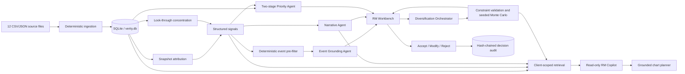

# Verity — Grounded Wealth Intelligence for Relationship Managers

**SingHacks 2026 · Track 1: Julius Baer Wealth Intelligence**

> Verity turns five dated portfolio snapshots and fragmented client records into what a Relationship Manager needs before a meeting: who needs attention, what changed, why it matters to that specific client, and what the RM can responsibly consider next — with every material claim traceable to source.

## Executive summary

Relationship Managers do not lack data. They lack enough time to reconcile holdings, transactions, mandates, facilities, cash needs, client objectives, RM notes, and market events across an entire book before back-to-back meetings. Conventional dashboards describe balances and performance, but they rarely explain why a change matters to a client's life or give the RM a defensible way to act on it.

Verity is a grounded wealth-intelligence workbench for that gap. It combines deterministic portfolio analytics with narrowly scoped `gpt-4o` agents to:

1. detect material changes and hidden risks without asking an LLM to do financial arithmetic;
2. connect signals to permitted evidence and state when no causal link can be established;
3. translate verified facts into client-specific briefing narratives;
4. compare mandate-aware diversification options under reproducible scenarios;
5. rank an RM's client book by explainable attention priority;
6. answer client-scoped questions through a read-only, citation-backed Copilot; and
7. keep the RM in control through explicit Accept, Modify, or Reject decisions and tamper-evident audit chains.

The current dataset contains **20 clients, 1,015 holding rows, 16 market events, 36 generated signals, and 4 detected data-quality flags**. These counts are checked by `npm run verify`.

## The challenge

The challenge's north star is:

> **“Build the intelligence layer between portfolio data and the Relationship Manager.”**

It asks teams to help an RM move from:

> “What does my client's portfolio look like?”

to:

> “What should I know, why does it matter to this client, and what should I do next?”

The official rubric places equal weight on:

- **Client-Centric Innovation — 25%:** addresses real private-banking client needs and differentiates Julius Baer's digital offering.
- **User Experience & Design — 25%:** simplicity, clarity, and actionability of wealth insights.
- **Technical & Operational Feasibility — 25%:** realistic implementation within banking architecture, including security, scalability, and compliance.
- **Strategic Impact — 25%:** strengthens Julius Baer as a modern, tech-enabled wealth manager while preserving the central role of the RM.

The challenge also emphasizes that this is not merely an arithmetic exercise: defendable reasoning, judgement about what matters, depth on two or three clients, honest uncertainty, and RM control matter more than confident but unsupported output.

### How Verity answers the challenge

- **From data to personal relevance:** portfolio losses, concentration, liquidity, and collateral facts are interpreted alongside age, life stage, objectives, risk tolerance, cash needs, and RM context.
- **From black-box AI to inspectable evidence:** signals cite source rows; generated explanations cite retrieved records; evidence can be opened in the UI; unsupported answers are refused.
- **From generic suggestions to constrained options:** diversification proposals are deterministically checked and repaired against mandate, funding, liquidity, reserved-cash, and position constraints before they are shown.
- **From “AI said so” to RM accountability:** Verity never executes a trade. Accept, Modify, and Reject are main-workbench decisions recorded with model, prompt, confidence, input hashes, context hashes, evidence, and a SHA-256 link to the previous decision.
- **From a client list to an actionable morning:** book-wide risk prioritization combines computed metrics with five explicit risk dimensions, producing a ranked “who to call first” view.

## Primary user and beneficiaries

**Primary user — Priscilla Ong, Relationship Manager**

- Asia desk; Singapore and Hong Kong booking centres
- 20 ultra-high-net-worth clients with roughly USD 8M–88M in AUM
- Back-to-back meetings and limited time for manual reconciliation
- Needs concise, defensible conversation preparation rather than another data dashboard

**Clients** receive more timely, personal conversations tied to their objectives rather than generic performance commentary.

**Risk, compliance, and product teams** receive source lineage, bounded model behavior, explicit uncertainty, human decisions, and audit records.

## End-to-end advisory flow

The following is the complete journey from raw data to an RM-controlled client conversation.

### 0. Book preparation

Before Priscilla starts her day, Verity prepares a structured view of the book:

1. `npm run ingest` loads the 12 supplied CSV/JSON sources into SQLite.
2. Wide time-series columns are normalized into dated price, AUM, facility, and FX tables.
3. ingestion identifies missing cost basis, pre-relationship snapshots, lagged marks, and other data-quality conditions.
4. `npm run pipeline` compares the earliest and latest available snapshots, creates deterministic signals, and pre-filters possible market-event explanations.
5. If agents are enabled, the event-grounding agent assesses candidate events. Existing input hashes allow matching grounded results to be reused.
6. Book priorities can be generated through the protected priorities API and are reused while their input hash is unchanged.

No LLM calculates P&L, exposure, concentration, allocation, mandate compliance, scenario paths, VaR, CVaR, or drawdown.

### 1. Secure RM sign-in

Priscilla signs in through `/login`.

- The pilot authenticates against an environment-configured username and scrypt password hash.
- The server creates a random opaque session token and stores only its SHA-256 hash.
- The browser receives an `HttpOnly`, `SameSite=Lax` cookie; production cookies are `Secure`.
- Sessions expire after eight hours and can be revoked through logout.
- Every protected page authenticates before reading client data.

This is an intentional pilot boundary. A regulated deployment should replace the custom credential check with the bank's OIDC/SSO provider.

### 2. Morning Brief — decide who to call first

The authenticated home page is the RM's book-level command centre.

1. Verity retrieves only clients assigned to the signed-in RM.
2. Each client card shows AUM, signal count, the two leading signals, source lineage, and the latest model-assisted risk-priority badge.
3. Clients are sorted first by book-calibrated risk score and then by deterministic signal urgency.
4. Priority generation assesses five visible dimensions:
   - signal severity;
   - liquidity deadlines;
   - concentration;
   - credit/margin risk; and
   - data uncertainty.
5. The result assigns an attention band: **Call today**, **This week**, or **Monitor**.

The score is an ordering aid, not an automated decision. Its summary, rationale, uncertainty, and evidence references remain inspectable.

### 3. Client Dossier — understand the whole client

Selecting a client opens `/client/[clientId]`, scoped to the RM's book.

The dossier brings together:

- client profile, life stage, objectives, tax domicile, horizon, and risk profile;
- AUM and book-calibrated risk priority;
- all portfolios and mandate names;
- portfolio allocation charts;
- household top-holdings chart and expandable holdings list;
- data-quality warnings;
- deterministic risk and explanation signals;
- source-row disclosures and event-grounding results; and
- the client-scoped RM Copilot.

This avoids the central failure mode of portfolio-by-portfolio dashboards: economically identical exposure can be hidden across accounts or inside structured products.

### 4. Inspect a signal and its evidence

Each signal card shows:

- signal type and subtype;
- plain-language headline;
- USD and percentage magnitude where applicable;
- affected holdings;
- deterministic analysis window;
- direct source references;
- grounded market-event explanation, confidence, or an explicit no-match result; and
- expandable evidence values for review.

Verity treats “what changed” and “why it changed” differently. The former is computed from portfolio data. The latter is only stated when the bounded event-grounding process finds a plausible mechanism among supplied event-log candidates.

### 5. Generate a client-specific narrative

The RM selects **Generate Analysis** on a signal.

1. The server verifies the RM session, same-origin request, rate limit, daily AI budget, concurrency limit, and ownership of the signal.
2. A stable hash is computed from the prompt version, signal, and client context.
3. A matching cached narrative is returned when available.
4. Otherwise, the Narrative Agent receives verified signal values and selected client context.
5. `gpt-4o` returns schema-validated structured output:
   - a three-part story covering what happened, why it matters, and what to consider;
   - a suggested opening line for the client conversation;
   - a conservative discussion-oriented action with steps, rationale, and confidence;
   - caveats; and
   - overall confidence.
6. A deterministic suitability layer labels free-form actions as discussion-only, no-change, or requiring quantified analysis.
7. Internal reference tags are removed, the response is cached, and a model-use security event is recorded.

The Narrative Agent is forbidden to perform arithmetic, invent allocation percentages, or claim that a free-form portfolio change is suitable or mandate-compliant.

### 6. Explore quantified diversification options

If the narrative suggests that portfolio change deserves analysis, the RM selects **Explore Diversification**. The UI streams progress as Verity completes a multi-stage workflow:

1. **Evidence retrieval**
   - retrieves the signal, client objectives, current holdings, portfolio mandates, cash needs, liquidity tiers, and data-quality flags;
   - builds a normalized portfolio envelope and a hash of the context pack.
2. **Constraint construction**
   - establishes the baseline value;
   - reserves required cash;
   - records mandate ranges, single-position limits, liquidity constraints, and suitability inputs.
3. **Action generation**
   - asks a narrowly scoped agent for three objectives-aligned approaches;
   - uses deterministic action templates if model generation is unavailable.
4. **Deterministic validation and repair**
   - makes every trade fully funded;
   - clips or repairs proposals that breach constraints;
   - checks resulting portfolio allocations against each managed portfolio's mandate;
   - excludes custody portfolios from managed-mandate claims;
   - returns a constraint-aware “hold/review” result if no safe funded trade pair exists.
5. **Reproducible scenario simulation**
   - runs seeded 36-month Monte Carlo paths;
   - uses common random market paths so hold-current and proposed actions are comparable;
   - evaluates four scenarios: Central, Hormuz Re-escalation, De-escalation, and Rate Shock Persistence;
   - computes P10/P50/P90 terminal values, expected and annualized return, volatility, Sharpe ratio, 95% VaR, 95% CVaR, probability of loss, and median-path maximum drawdown.
6. **Risk and suitability scoring**
   - evaluates concentration, liquidity, mandate checks, client risk tolerance, and profile;
   - states whether the action is mandate-compliant and tolerance-aligned.
7. **Summary generation**
   - asks a separate summary agent to explain only the already-computed result;
   - applies a confidence ceiling based on source quality and prior narrative confidence;
   - falls back to a deterministic summary if the model is unavailable.
8. **Presentation and caching**
   - displays three selectable actions, concrete trades or safe fallback, scenario chart, trade-offs, talking points, methodology, assumptions, caveats, and evidence;
   - caches the plan by context, assumption-set, and suitability-version hash.

These are **assumption-driven illustrations, not forecasts or executable orders**. The UI says so explicitly and exposes the capital-market assumptions.

### 7. Make and record the RM decision

Narrative recommendations and each diversification action have **Accept**, **Modify**, and **Reject** controls.

- **Accept** records RM acknowledgement only. It does not place or route an order.
- **Modify** requires written instructions.
- **Reject** uses a controlled reason taxonomy, with mandatory detail for “Other”.

Before appending a decision, the server resolves the authoritative stored target and verifies that it belongs to the claimed client and signed-in RM. The audit record includes:

- before and after state;
- reason code and free text where relevant;
- confidence at decision time;
- model and prompt version;
- model input hash and context-pack hash;
- source references;
- previous audit hash; and
- the entry's SHA-256 hash.

This creates a deterministic append-only decision chain and preserves exactly what the RM reviewed.

### 8. Ask grounded follow-up questions

The **Ask Verity** widget is available in every client dossier.

1. Opening the widget loads three client-specific suggested questions derived deterministically from the client's leading signals.
2. A user question is classified into portfolio, signal, risk, liquidity, mandate, transaction, facility, source, or general intent.
3. Verity retrieves relevant client-scoped records: profile, signals, latest holdings, mandates, facilities, cash needs, commitments, optional transactions and RM notes, cached narratives, and diversification plans.
4. Records are scored by intent, query terms, and signal urgency, then trimmed to a bounded context budget.
5. The context pack is hashed and the client's name is pseudonymized before model processing.
6. The Copilot answers only from the retrieved pack and returns citations, confidence, caveat, and exactly three follow-up questions.
7. Output guards reject foreign-client IDs, unsafe instructions, unsupported citations, and financial numbers that cannot be traced to the pack.
8. If a quantitative relationship would be clearer visually, a second model call selects from deterministic chart candidates. It may choose pie, bar, line, or histogram, but cannot create or alter chart data.
9. The server streams text, citations, confidence, chart status/data, and follow-ups through Server-Sent Events.

The Copilot is deliberately read-only. Requests to accept, modify, reject, execute, buy, or sell are refused and redirected to the audited workbench controls. Prompt-disclosure and instruction-injection requests are also refused. RM notes are treated as untrusted data, and instruction-like note content is withheld.

### 9. Prepare the client conversation

At the end of the flow, Priscilla has:

- a defensible reason this client should be contacted now;
- the computed portfolio facts;
- an evidence-grounded causal explanation where one exists;
- a tailored opening line;
- quantified options and trade-offs where portfolio action is appropriate;
- explicit caveats and confidence ceilings; and
- a recorded human decision.

Nothing is sent to the client and no trade is executed by Verity. The product prepares the RM to conduct the conversation and use existing bank execution and approval processes.

## Feature deep dives

### Deterministic snapshot attribution

`lib/compute/snapshotDiff.ts` compares position snapshots and separates change into price, quantity/client-flow, FX, and residual fields. Transactions help distinguish client-directed changes from market-driven moves. The engine can then surface duration-related fixed-income losses without asking a model to infer or recompute portfolio values.

The present implementation calculates price, quantity, and residual effects but sets the FX effect to zero as a documented simplification. FX time-series data is ingested, but full FX attribution is a future compute enhancement.

### Household look-through concentration

`lib/compute/lookThrough.ts` aggregates exposure across all of a client's portfolios. `lib/compute/underlyingMap.ts` resolves known structured products into underlying economic exposures and applies explicit assumptions and confidence ceilings. Concentration above the configured 15% signal threshold becomes a source-backed risk signal.

This catches exposure that neither a single-account check nor the product wrapper's label would reveal.

### Event Grounding Agent

The grounding workflow is intentionally narrow:

1. code derives terms from the signal and affected instruments;
2. code filters events to those within 180 days with topic overlap;
3. code ranks at most eight candidates by overlap and date proximity;
4. the agent may select at most three IDs from that allow-list;
5. code rejects any out-of-set ID;
6. matched confidence is capped at 85; and
7. a weak or absent mechanism returns **“No clear causal link found in the event log.”** with confidence below 30.

This prevents a language model from filling evidence gaps with general market knowledge.

### Two-stage book prioritization

Prioritization uses two distinct structured `gpt-4o` calls:

1. **Risk summary stage:** creates one evidence-cited summary per client without ranking.
2. **Scoring stage:** scores all clients relative to the same book using the five required dimensions and fixed attention bands.

Code verifies complete client coverage, validates every numeric statement against supplied facts, normalizes evidence IDs, clamps scores to 1–100, ranks deterministically, and caches results by a reproducible input hash.

### Grounded evidence UX

Verity exposes evidence at three levels:

- compact source-lineage footers on queue and signal cards;
- expandable source values and grounded-event detail in the dossier; and
- citation chips on Copilot answers, with citation views recorded in the security audit log.

The product's teal/grounded visual treatment is a learned trust cue for content that can be inspected against source.

### Human-in-the-loop governance

Human control is architectural rather than cosmetic:

- free-form narrative actions cannot claim quantified suitability;
- only the deterministic diversification path can report mandate and tolerance checks;
- chat cannot trigger decisions or trades;
- the server, not the browser, resolves the decision artifact;
- every decision captures evidence and provenance at the moment of review; and
- “Accept” means workflow acknowledgement, never execution.

### Visual decision support

The dossier includes portfolio-allocation and top-holdings pie charts. Diversification results use scenario-return charts and detailed risk statistics. Copilot charts are rendered only when a deterministic candidate directly supports the requested relationship; otherwise the planner explicitly skips visualization.

## Demo client stories

### CL-0001 — hidden household concentration

Hartono Wijaya Kusuma appears healthy at a portfolio-summary level, but look-through aggregation reveals approximately **42.6% household exposure to Bara Nusantara Energy** across wrappers and accounts. Verity turns the hidden concentration into a source-backed signal, connects relevant evidence without inventing an event, and lets the RM compare constrained diversification actions under four scenarios.

**Why it matters:** the risk exists at household level and may affect collateral resilience even if no individual mandate dashboard flags it.

### CL-0012 — retirement income and duration

Cheung Kwok Wing is a retired client whose fixed-income holdings show approximately **USD 2.7M of duration-driven losses**. The useful insight is not simply that bonds fell; it is that long-duration and perpetual exposure may not naturally mature into the income solution the client expects.

**Why it matters:** the RM must discuss cash-flow resilience and available alternatives in the context of retirement, not just report performance.

### CL-0003 — inherited allocation versus present objectives

Margarethe Voss-Brenner has a conservative profile but a materially equity-heavy inherited portfolio, plus a known cash requirement and a missing-cost-basis warning on one holding. Verity puts allocation, objective, liquidity timing, and data uncertainty in one dossier before any action is considered.

**Why it matters:** suitability depends on the client's current purpose and obligations, not the history of how the assets arrived.

The system supports the full 20-client book, while these three cases demonstrate the challenge's preference for depth and personal relevance.

## System architecture



### Architectural principles

1. **Grounding over generation** — explanations must point to permitted records.
2. **Deterministic compute, generative communication** — code owns numbers and constraints; models explain bounded inputs.
3. **Least privilege by context** — every page and API action is RM- and client-scoped.
4. **Human always in the loop** — model output is advisory and cannot execute.
5. **Honest uncertainty** — no-match states, caveats, data-quality ceilings, and safe fallbacks are first-class output.
6. **Reproducibility** — prompt versions, input hashes, context hashes, seeded simulations, and cached artifacts make results reviewable.
7. **Graceful degradation** — verified portfolio data remains usable with agents disabled; diversification has deterministic proposal and summary fallbacks.

### Data and storage

Input files in `data/`:

- `clients.csv` — identity, RM ownership, profile, objectives, horizon, and risk tolerance
- `portfolios.csv` — accounts, mandates, service model, benchmark, and dated AUM
- `holdings.csv` — five dated position snapshots
- `instruments.csv` — asset metadata, liquidity, and underlying references
- `mandates.csv` — allocation bands and position limits
- `transactions.csv` — client-directed activity
- `credit_facilities.csv` — facilities, collateral, margin trigger, and dated snapshots
- `commitments.csv` — called and uncalled private-market commitments
- `planned_cash_needs.csv` — amount, timing, recurrence, and certainty
- `market_context.csv` — dated market series
- `event_log.csv` — bounded event evidence used for causal grounding
- `rm_notes.json` — relationship context treated as untrusted text

SQLite stores normalized source data plus:

- `signals`
- `groundings`
- `narratives`
- `diversification_plans`
- `priorities`
- `audit_log`
- `security_audit_log`
- `auth_sessions`
- `chat_conversations`
- `chat_messages`
- `request_rate_limits`
- `ai_budget_usage`

SQLite runs in WAL mode with foreign keys and secure deletion enabled. Production startup requires an explicit database path and encryption-at-rest acknowledgement.

### API surface

- `POST /api/auth/login` — authenticate and create an opaque session
- `POST /api/auth/logout` — revoke the current session
- `POST /api/narrative/[signalId]` — generate or return cached signal analysis
- `POST /api/diversify/[signalId]` — stream diversification stages and results
- `GET /api/priorities` — retrieve the RM's latest priorities
- `POST /api/priorities` — admin-restricted book-wide generation
- `GET /api/chat/openers?clientId=...` — client-specific suggested questions
- `POST /api/chat` — stream grounded answer, citations, confidence, chart, and follow-ups
- `GET /api/decisions` — retrieve the latest decision for an artifact
- `POST /api/decisions` — append Accept, Modify, or Reject decision
- `POST /api/audit/citation` — record inspection of cited evidence

All mutating routes authenticate, enforce same-origin policy, and apply route-specific abuse controls.

## What makes Verity distinctive

### It detects the risk the wrapper hides

Household-level aggregation and structured-product look-through reveal economic exposure across accounts. This is materially different from sorting positions within one portfolio.

### It separates facts, interpretations, and projections

- **Facts** are computed from source data.
- **Interpretations** are generated from bounded, cited context.
- **Projections** are seeded, assumption-driven illustrations with visible methodology.

The UI and contracts preserve these distinctions instead of presenting all three as equivalent “AI insights.”

### It validates AI proposals with code

An LLM can suggest an approach, but deterministic code decides whether the trades are funded, liquid, mandate-aware, and suitable for quantified comparison. Invalid proposals are repaired or replaced by a safe hold/review result.

### It makes refusal useful

No-match grounding, unsupported Copilot questions, untraceable numbers, prompt injection, cross-client references, and execution requests produce explicit refusals that tell the RM what evidence or workflow is required next.

### It captures the decision, not just the output

The auditable unit is not merely a generated paragraph. It is the generated artifact, its exact provenance and evidence, the confidence shown at review time, and the RM's recorded response.

## Alignment with the judging rubric

### Client-Centric Innovation — 25%

- Connects portfolio facts to life stage, retirement income, objectives, liquidity needs, tax domicile, and known client context.
- Produces an RM opening line and talking points, not just metrics.
- Goes deep on three distinct client archetypes while supporting all 20 clients.
- Finds hidden household and look-through risks that a conventional account dashboard misses.
- Keeps recommendations conservative and distinguishes discussion from quantified suitability.

### User Experience & Design — 25%

- Starts with a ranked Morning Brief built around the RM's real “who do I call first?” task.
- Uses progressive disclosure: queue → dossier → signal → evidence → narrative → scenario comparison → decision.
- Provides source footers, evidence drawers, confidence badges, caveats, data-quality flags, charts, and streamed progress.
- Keeps a persistent client-scoped Copilot beside the main workflow.
- Uses deterministic client-specific opening questions and generated follow-ups to reduce blank-page friction.
- Presents Accept/Modify/Reject where the recommendation is reviewed, while clearly stating that acceptance does not execute.

### Technical & Operational Feasibility — 25%

- Keeps arithmetic, risk metrics, constraint checks, and simulations in testable TypeScript.
- Uses schema-validated model output and bounded candidate/context sets.
- Enforces RM-level authorization, same-origin mutation, rate limits, concurrency caps, token budgets, and a model kill switch.
- Uses pseudonymization, prompt-injection guards, numeric traceability, source validation, and cross-client output checks.
- Caches by versioned input/context hashes and supports deterministic fallbacks.
- Maintains decision and security audit chains.
- Includes 33 passing automated tests across Copilot, decisions, diversification, grounding, prioritization, authorization, policies, and route boundaries.

### Strategic Impact — 25%

- Compresses hours of manual book reconciliation into a prioritized, meeting-ready workflow.
- Helps RMs hold more timely, personal, evidence-backed conversations.
- Creates structured feedback from accepted, modified, and rejected recommendations.
- Provides a credible path to bank deployment through OIDC integration, enterprise model hosting, encrypted managed storage, and existing execution rails.
- Scales conceptually from one RM's morning brief to governed intelligence across a wealth-management organization.

## Technology stack

**Application**

- Next.js 16.3 App Router
- React 19.2
- TypeScript 5
- Tailwind CSS 4

**Data and analytics**

- SQLite through `better-sqlite3`
- `csv-parse`
- deterministic TypeScript compute modules
- seeded Monte Carlo simulation and constraint repair

**AI**

- OpenAI `gpt-4o`
- OpenAI structured outputs
- Zod 4 contracts and validation
- distinct agents for event grounding, narratives, priority synthesis/scoring, diversification actions/summaries, Copilot answers, and chart selection; Copilot opening questions are derived deterministically from current signals

**Visualization**

- Recharts 3
- portfolio allocation, top holdings, scenario paths, and grounded Copilot charts

**Security and quality**

- Node.js `crypto` for scrypt, SHA-256 hashes, opaque tokens, and random IDs
- server-side RM/client authorization
- Node test runner via `tsx --test`
- ESLint 9 with Next.js rules

## Security, privacy, and compliance posture

Implemented pilot controls include:

- server-only credential and session handling;
- scrypt password verification;
- hashed, revocable, expiring session tokens;
- RM-level client and signal access checks;
- same-origin enforcement for mutation;
- request rate, concurrency, and daily token-budget controls;
- admin allow-list for book-wide priority generation;
- global `VERITY_AGENTS_ENABLED` model kill switch;
- de-identification before selected model calls;
- bounded retrieval and explicit untrusted-data delimiters;
- prompt-injection, prompt-disclosure, unsafe-action, cross-client, and citation guards, plus numeric-traceability validation on priority and Copilot outputs;
- input/context hashes and prompt versions;
- hash-linked decision and security audit events;
- production HSTS and other response headers; and
- production database encryption-at-rest acknowledgement.

See `SECURITY.md` for operational controls and production boundaries.

## Local setup

### Prerequisites

- Node.js 20 or later recommended
- npm
- an OpenAI API key with `gpt-4o` access for agent-powered features

### 1. Install

```powershell
cd verity
npm install
```

### 2. Configure `.env.local`

Create `verity/.env.local` with the following values:

```dotenv
OPENAI_API_KEY=your-key
VERITY_AGENTS_ENABLED=true

VERITY_AUTH_USERNAME=priscilla
VERITY_AUTH_PASSWORD_HASH=generated-scrypt-hash
VERITY_AUTH_RM_ID=RM-SG-014
VERITY_AUTH_DISPLAY_NAME=Priscilla Ong

VERITY_PRIORITY_ADMIN_RM_IDS=RM-SG-014
VERITY_DAILY_TOKEN_BUDGET=100000
```

Generate the password hash without saving a plaintext password:

```powershell
npm run hash-password -- "your-pilot-password"
```

Optional deployment variables:

```dotenv
VERITY_DB_PATH=/secure/managed-volume/verity.db
VERITY_DB_ENCRYPTION_AT_REST_ACKNOWLEDGED=true
```

Do not commit `.env.local` or `verity.db`. Use an approved secret manager and enterprise model endpoint before processing non-synthetic client data.

### 3. Ingest and compute

```powershell
npm run ingest
npm run pipeline
npm run verify
```

Expected verified core counts:

```text
Clients: 20
Holdings: 1015
Events: 16
Signals: 36
Data-quality flags: 4
```

If `VERITY_AGENTS_ENABLED` and `OPENAI_API_KEY` are configured, the pipeline also runs event grounding for candidate-bearing signals. Without them, deterministic signals still work and no-match records can still be created where there are no candidates.

### 4. Run

```powershell
npm run dev
```

Open [http://localhost:3000](http://localhost:3000) and sign in with the configured pilot credentials.

## Verification and tests

```powershell
npm run verify
npm test
npm run lint
npm run build
```

The current automated suite contains 33 tests covering:

- Copilot retrieval, context isolation, chart materialization, sanitization, and action refusal;
- decision contracts, target ownership, and SHA-256 audit chaining;
- seeded scenario reproducibility, capital-market assumptions, funded trade repair, mandate treatment, and suitability;
- deterministic event filtering and no-match grounding behavior;
- priority input completeness, de-identification, and reproducible hashing; and
- authentication ordering, authorization, prompt/input/output guards, origin policy, rate limits, and session expiry/revocation.

## Repository structure

```text
verity/
├── app/
│   ├── api/
│   │   ├── auth/                 # Login and logout
│   │   ├── audit/citation/       # Citation-view audit
│   │   ├── chat/                 # Grounded Copilot and openers
│   │   ├── decisions/            # RM decision workflow
│   │   ├── diversify/            # Streaming scenario workflow
│   │   ├── narrative/            # Signal narrative generation
│   │   └── priorities/           # Book-wide priority generation
│   ├── client/[clientId]/        # Client dossier
│   ├── login/                    # Pilot authentication
│   ├── profile/                  # RM profile
│   └── page.tsx                  # Morning Brief
├── components/
│   ├── auth/
│   ├── charts/
│   ├── copilot/
│   ├── navigation/
│   ├── priority/
│   └── verity/                   # Signals, evidence, decisions, diversification
├── data/                         # Synthetic challenge dataset
├── lib/
│   ├── agents/                   # Bounded model workflows and guards
│   ├── compute/                  # Deterministic analytics and simulation
│   ├── contracts/                # Zod schemas
│   ├── db/                       # SQLite connection and repository
│   ├── decisions/                # Decision target resolution
│   └── security/                 # Auth, access, abuse, audit, conversation
├── scripts/
│   ├── hashPassword.ts
│   ├── ingest.ts
│   ├── pipeline.ts
│   └── verify.ts
└── tests/
```

## Current scope and production boundaries

Verity is a functional hackathon pilot, not a production banking system.

- Data is synthetic and local.
- Pilot credentials must be replaced with enterprise OIDC/SSO.
- SQLite should be replaced or operated on an encrypted, access-controlled managed volume with backup and deletion policies.
- In-memory rate and concurrency controls should move to shared infrastructure for multi-instance deployment.
- `gpt-4o` access must use approved residency, contractual, and zero-retention terms.
- Scenario assumptions are illustrative and use limited source history; they are disclosed rather than presented as forecasts.
- Structured products and alternatives are approximated at asset-class level in scenario modeling.
- Verity does not integrate with order management, suitability approval, or trade execution.
- RM decisions are acknowledgements and workflow records only.
- Book priority generation is protected by an admin allow-list and is not automatically triggered by page rendering.
- The batch signal pipeline currently emits duration and concentration signals. Mandates, facilities, commitments, and cash needs inform priority, Copilot, and diversification workflows but do not yet produce standalone mandate-breach, LTV, or liquidity-ladder signals.
- There is no dedicated liquidity-ladder or facility LTV screen; those records are available to retrieval, prioritization, and supported Copilot visualizations.
- The test suite covers scenario reproducibility and security boundaries but does not yet include golden-number regression tests for snapshot attribution and look-through outputs.

## Product thesis

The winning wealth-intelligence experience is not the one that generates the most text. It is the one an RM can inspect, challenge, and responsibly stand behind.

Verity's core design choice is therefore simple:

> **Code computes. Models communicate. Evidence constrains. The RM decides.**
